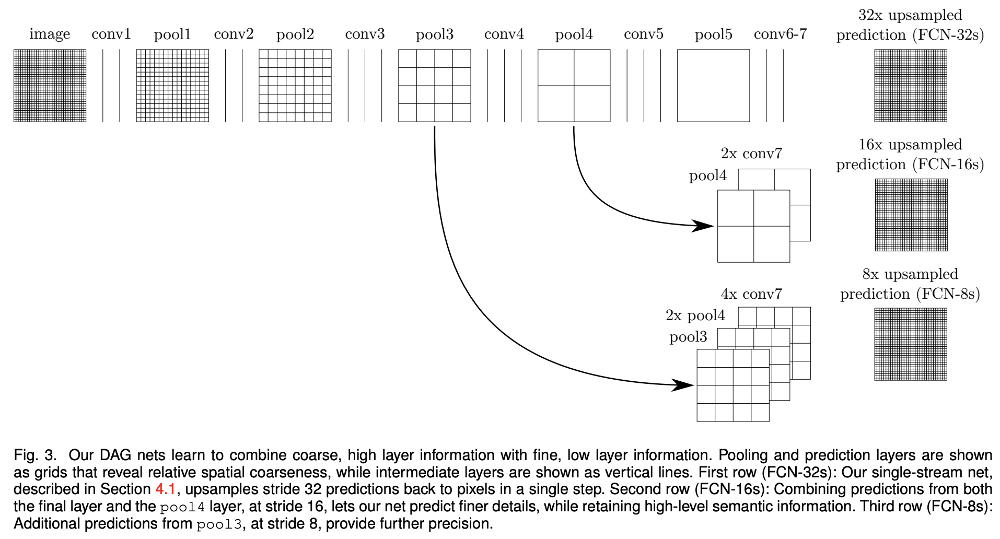

# FCN Implementation with Pytorch


## 0. Develop Environment
```
Docker Image
- tensorflow/tensorflow:tensorflow:2.4.0-gpu-jupyter

Library
- Pytorch : Stable (1.7.1) - Linux - Python - CUDA (11.0)
```
- Using Single GPU (not tested on cpu only)


## 1. Explain about Implementation
- model.py : FCN_8s, FCN_16s, FCN_32s
- train.py : train model
- utils.py : calculate mIoU, pixel acc
- Used similar train settings of 2016 FCN paper but changed some of the settings cause of resource issues
  * input
    * train : (3, 224, 224)
    * test : (3, 256, 256)
  * batch size : 1
  * learning rate : 0.0001
  * momentum : 0.99
  * weight decay : 0.0005
- Not fixed final deconvolution layer to bilinear interpolation but learned
- mIoU score may be different with paper cause of dataset (if you want to reproduce, click [here](https://github.com/shelhamer/fcn.berkeleyvision.org/tree/master/data/pascal) for reference)


## 2. Brief Summary of *'2014 Fully Convolutional Networks for Semantic Segmentation'*

### 2.1. Goal
- Make network with end-to-end, pixels-to-pixels for semantic segmentation

### 2.2. Intuition
- Convolutionalization : classification network can get arbitrary image input
- Deconvolution : learnable upsampling
- Skip : fuse local information and global information

### 2.3. Evaluation Metric
- Mean pixel intersection over union with the mean taken over all classes, including background

### 2.4. Network Architecture


- Initialization
  * final deconvolution layers : fixed to bilinear interpolation
  * intermediate upsampling layer : bilinear interpolation
  * class scoring convolution layer : zero-initialized
  * FCN-16s : FCN-32s

### 2.5. Train and Inference on PASCAL VOC 2011
- Objective : per-pixel multinomial logistic loss (no class balancing)
- Train Details
  * minibatch SGD with momentum
    * batch size : 20
    * learning rate : 0.0001
    * momentum : 0.9
    * weight decay : 0.0002 or 0.0005


## 3. Reference Paper
- 2014 Fully Convolutional Networks for Semantic Segmentation [[paper]](https://arxiv.org/pdf/1411.4038.pdf)
- 2016 Fully Convolutional Networks for Semantic Segmentation [[paper]](https://arxiv.org/pdf/1605.06211.pdf)
- Original FCN Implementation with Caffe [[github]](https://github.com/shelhamer/fcn.berkeleyvision.org)
